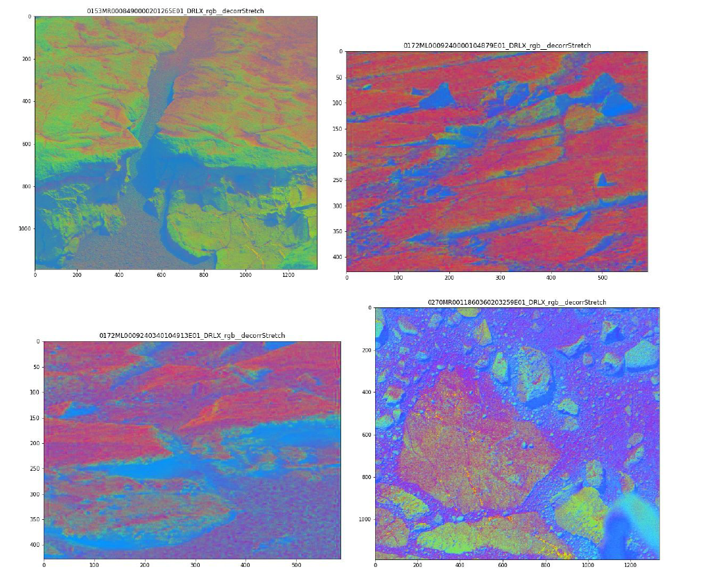

# Segmentation of Martian Terrain using Clustering Algortims like Kmeans, Mean shift.

## Intorduction

The Images obtained are of Martian terrain acquired by the Mastcam instrument of the Mars Science
Laboratory rover. The images contain rocks,soil, dust particles and parts of rover in them. The
objective of the project is to obtain segmentation using clustering techniques like k means,mean shift
algorithm,spectral clustering algorithms. K means algorithm is a popular clustering algorithm which
clusters using within-cluster sum-of-squares. The number of clusters have to be specified for K means
algorithm. Mean shift clustering technique tries to find the clusters based on centroid i.e the mean of
the data points in a region. The images have been transformed into color spaces like RGB,HSV and
techniques like decorrelation stretching have been explored.

## Experiments

a. The original images without any processing were given to K means algorithm with n_clusters of
range [2,16]. The elbows of the loss plot were around [4,6] indicating that the number of
clusters in the image lies in this range. This can be explained by considering
rocks,soil,dust,shadows,noise as individual cluster. So we are expected to get around [4,6]
clusters. Even though the k means grouped them into 6 clusters they were bad. This maybe due
to highly correlated images and poor separation between pixels of each cluster. 
b. We use decorrelation stretching technique before the image is sent to k means clustering
algorithm. This helps to remove the high correlation between the pixels and thus better
clustering and better segmentation of regions in images. The number of clusters were kept
around [4,6] for this experiment as well. 
c. Mean shifting algorithm was kept running for 4-5 hours and yet it did not converge even with
16gb of memory. Tried to implement speeding techniques mentioned in scikit documentation
and couldn’t make it to converge. The mean shift algorithm is usually computationally
expensive to use. So could not produce results using Mean shifting algorithm. 
d. The images were transformed into HSV format before clustering. The clusters of shadows were
better but overall this did not give any better results compared to decorrelation stretching +
kmeans. 
e. Tried to implement spectral clustering which does a low-dimension embedding of the affinity
matrix between samples but the space complexity of the algorithm is very high and hence the
algorithm breaks down for large images of type float32 . Agglomerative clustering is a
Hierarchical clustering algorithm. When it tries to evaluate distance it runs out of memory.

## Results

a. The K means reconstructed image for k values in range [2,16] for image
0153MR0008490000201265E01_DRLX . The images on the left are reconstructed images and
loss plot for original image without preprocessing and images on the right are reconstructed
images after decorrelation stretching.
<table>
  <tr>
    <td></td>
    <td></td>
  </tr>
 </table>

b. The Images below are images after decorrelation stretching. We can see that rocks in the first
image is colored in light green, shadows are of dark blue color and soil is in grey color. In the
second image the rocks are represented in blue color. In the third image the rocks are colored in
red. In fourth image the rocks covered in dust are colored red and other rocks are colored in
green.

